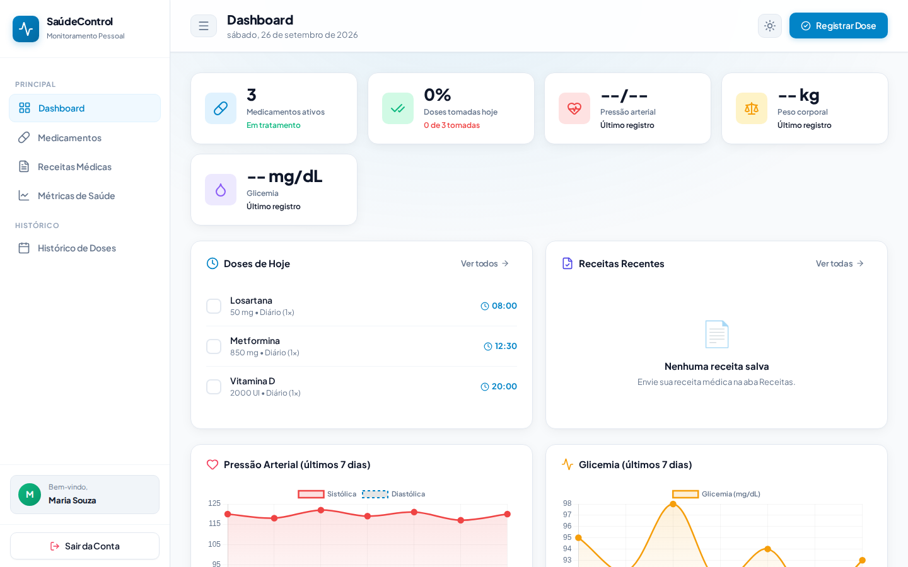
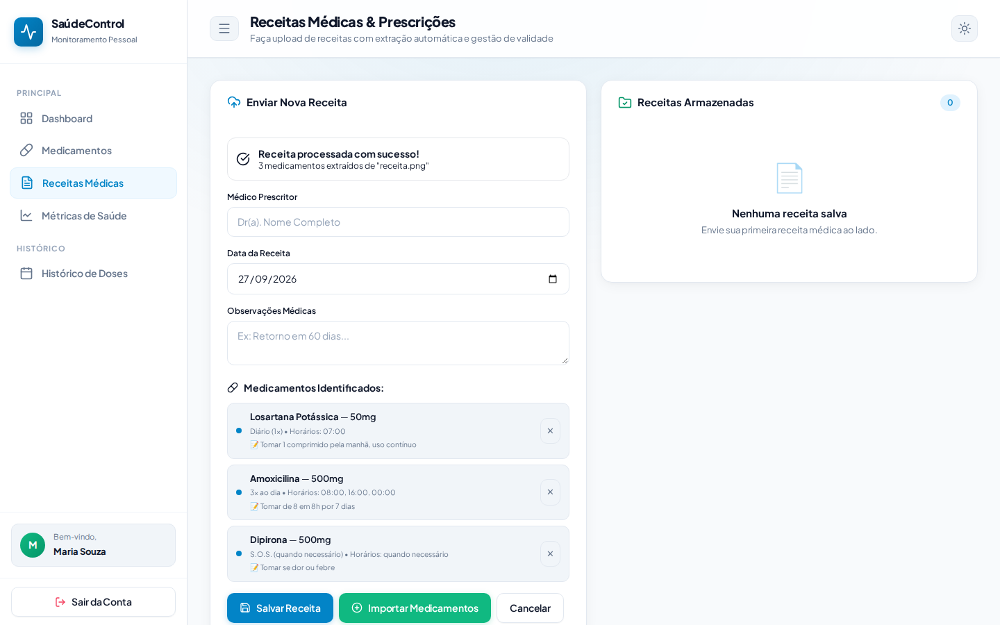
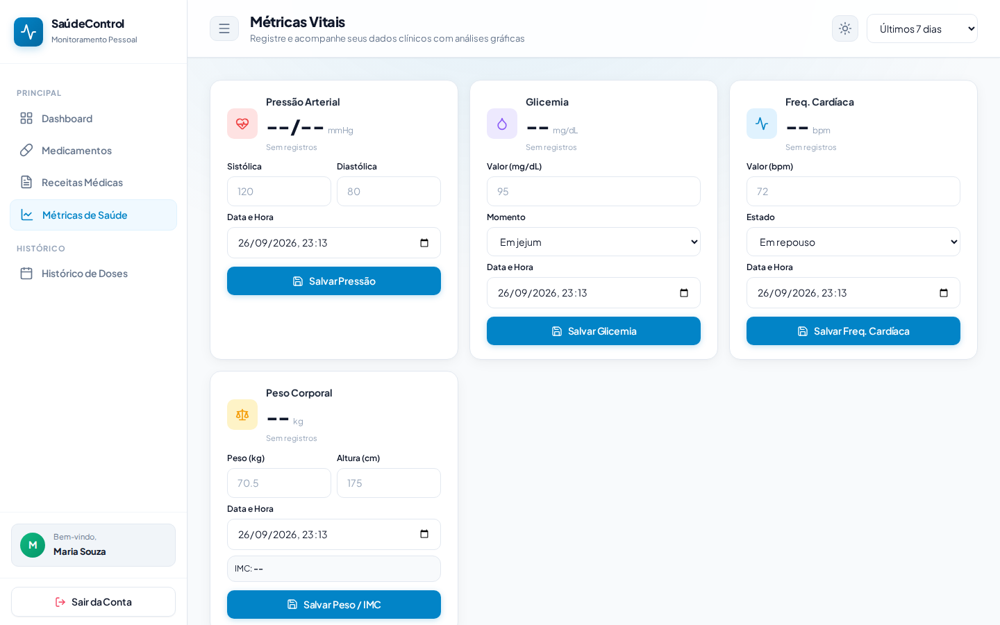

# SaúdeControl (MediControl)

[](https://github.com/MvitorLS/projeto-controle-medicamentos/actions/workflows/test.yml)

Aplicação web para quem toma remédio todo dia: agenda de doses, histórico de adesão, registro de pressão, glicemia, frequência cardíaca e peso, e leitura de receita médica para pré-preencher o cadastro do medicamento.



## Funcionalidades

- **Medicamentos**: dosagem, forma, frequência, horários, período e estoque; o dashboard monta as doses do dia a partir disso.
- **Histórico de adesão**: doses tomadas × previstas por semana e por mês (Chart.js).
- **Métricas vitais**: pressão arterial, glicemia (com momento da medição), frequência cardíaca e peso/IMC, com gráficos e exportação CSV.
- **Leitura de receitas**: a tela de receitas envia o PDF ou a foto para `POST /api/scanner`; o backend extrai o texto (`pdf-parse` para PDF, Tesseract.js em português para imagem) e o `server/parser.js` identifica nome, dosagem, frequência ("8/8h", "2x ao dia", "se dor"...), horários e quantidade. Os medicamentos reconhecidos podem ser importados direto para a agenda.
- **4 temas** (claro, escuro, OLED, menta) e animações com GSAP.

<details>
<summary>Leitura de receita (foto processada pelo OCR)</summary>


</details>

<details>
<summary>Tela de métricas</summary>


</details>

## Arquitetura

```
*.html + js/<página>.js   front em JavaScript puro, um módulo por página; js/app.js tem storage, tema, toasts e modal
server/
├── server.js             Express: serve o front e expõe /api/medicamentos, /api/medicoes, /api/scanner
├── routes/               rotas REST
├── parser.js             regex para receitas em português
├── upload.js             multer (limite de tamanho e tipos aceitos)
└── database.js           SQLite (better-sqlite3)
```

O front funciona sozinho (dados em `localStorage`) ou servido pelo Express, que adiciona a API e o banco SQLite.

## Rodando

```bash
npm install
npm start          # http://localhost:3000
npm test           # testes do parser de receitas (node:test)
```

Sem Node: abra `login.html` no navegador (modo só front; a leitura automática de receitas fica indisponível e sobra o cadastro manual). Na primeira leitura de imagem o Tesseract baixa os modelos de idioma para `data/`.

## Limitações e próximos passos

- [ ] O login é só local (usuários no `localStorage`) — serve para demonstração, não para dados reais de saúde.
- [ ] Sincronizar o front com a API/SQLite (hoje o front grava no `localStorage` mesmo quando servido pelo Express).
